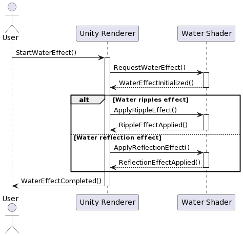
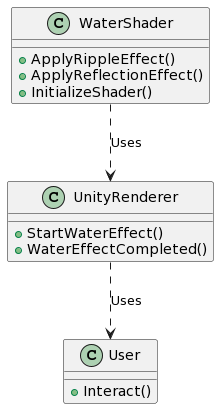
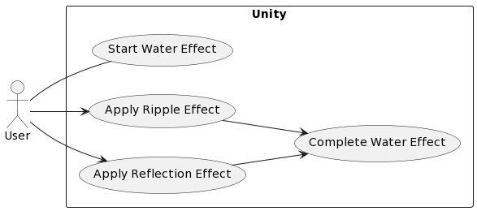

State

@startuml
[*] --> Start

state Idle {
  [*] --> Waiting
  Waiting --> Processing : OnWaterShaderEffectTriggered
  Processing --> Waiting : ShaderDone
  Processing --> Error : ShaderError
  Error --> Waiting : Retry
}

State Processing {
  [*] --> VertexShader : VertexShaderActivated
  VertexShader --> FragmentShader : VertexShaderDone
  FragmentShader --> BlurShader : FragmentShaderDone
  BlurShader --> WaterReflectionShader : BlurDone
  WaterReflectionShader --> WaterRippleShader : ReflectionDone
  WaterRippleShader --> Finish : RippleDone
  Finish --> Idle : Reset
}

[*] --> Idle
@enduml

Sequence

@startuml
actor User
participant "Unity Renderer" as Renderer
participant "Water Shader" as Shader

User -> Renderer: StartWaterEffect()
activate Renderer
Renderer -> Shader: RequestWaterEffect()
activate Shader
Shader --> Renderer: WaterEffectInitialized()
deactivate Shader

alt Water ripples effect
    Renderer -> Shader: ApplyRippleEffect()
    activate Shader
    Shader --> Renderer: RippleEffectApplied()
    deactivate Shader
else Water reflection effect
    Renderer -> Shader: ApplyReflectionEffect()
    activate Shader
    Shader --> Renderer: ReflectionEffectApplied()
    deactivate Shader
end

Renderer -> User: WaterEffectCompleted()
deactivate Renderer
@enduml

Class

@startuml
class WaterShader {
  +ApplyRippleEffect()
  +ApplyReflectionEffect()
  +InitializeShader()
}
class UnityRenderer {
  +StartWaterEffect()
  +WaterEffectCompleted()
}
class User {
  +Interact()
}
WaterShader ..> UnityRenderer : Uses
UnityRenderer ..> User : Uses
@enduml

Use-case

@startuml
left to right direction
skinparam packageStyle rectangle
actor User
rectangle Unity {
usecase "Start Water Effect" as start
usecase "Apply Ripple Effect" as ripple
usecase "Apply Reflection Effect" as reflection
usecase "Complete Water Effect" as complete
}
User -- start
User --> ripple
User --> reflection
ripple --> complete
reflection --> complete
@enduml

Код на языке C#
Процесс

public class WaterShader
{
    public void ApplyRippleEffect()
    {
        // Реализация метода
    }

    public void ApplyReflectionEffect()
    {
        // Реализация метода
    }

    public void InitializeShader()
    {
        // Реализация метода
    }
}

public class UnityRenderer
{
    public void StartWaterEffect()
    {
        // Реализация метода
    }

    public void WaterEffectCompleted()
    {
        // Реализация метода
    }
}

public class User
{
    public void Interact()
    {
        // Реализация метода
    }
}
