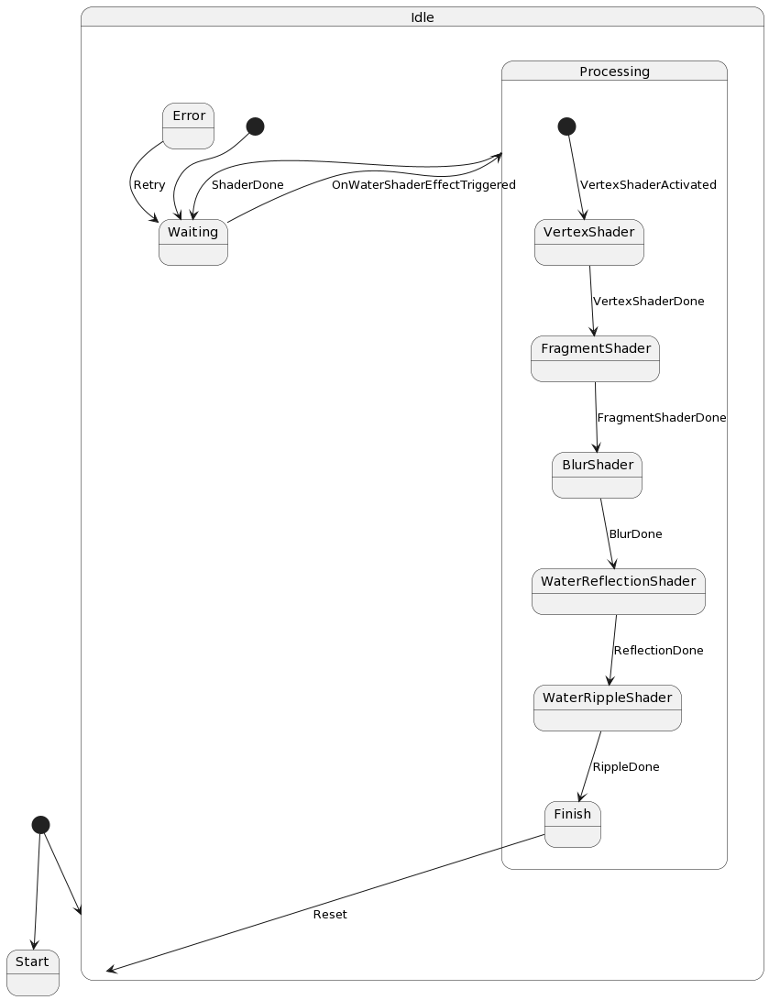

State

@startuml
[*] --> Start

state Idle {
  [*] --> Waiting
  Waiting --> Processing : OnWaterShaderEffectTriggered
  Processing --> Waiting : ShaderDone
  Processing --> Error : ShaderError
  Error --> Waiting : Retry
}

State Processing {
  [*] --> VertexShader : VertexShaderActivated
  VertexShader --> FragmentShader : VertexShaderDone
  FragmentShader --> BlurShader : FragmentShaderDone
  BlurShader --> WaterReflectionShader : BlurDone
  WaterReflectionShader --> WaterRippleShader : ReflectionDone
  WaterRippleShader --> Finish : RippleDone
  Finish --> Idle : Reset
}

[*] --> Idle
@enduml

Sequence
@startuml
actor User
participant "Unity Renderer" as Renderer
participant "Water Shader" as Shader

User -> Renderer: StartWaterEffect()
activate Renderer
Renderer -> Shader: RequestWaterEffect()
activate Shader
Shader --> Renderer: WaterEffectInitialized()
deactivate Shader

alt Water ripples effect
    Renderer -> Shader: ApplyRippleEffect()
    activate Shader
    Shader --> Renderer: RippleEffectApplied()
    deactivate Shader
else Water reflection effect
    Renderer -> Shader: ApplyReflectionEffect()
    activate Shader
    Shader --> Renderer: ReflectionEffectApplied()
    deactivate Shader
end

Renderer -> User: WaterEffectCompleted()
deactivate Renderer
@enduml

